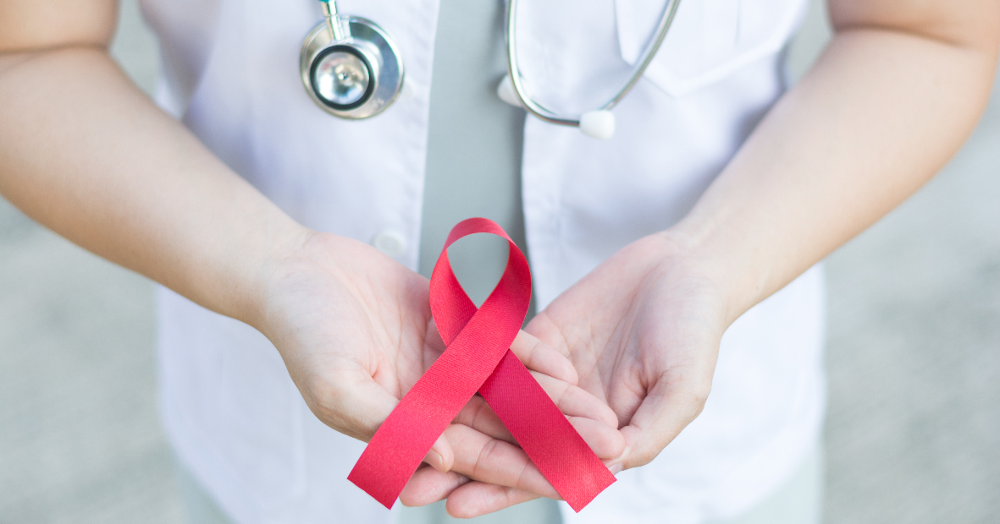
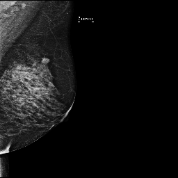
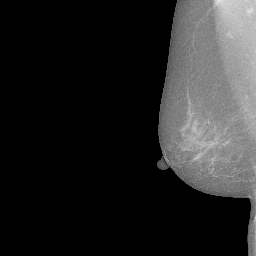
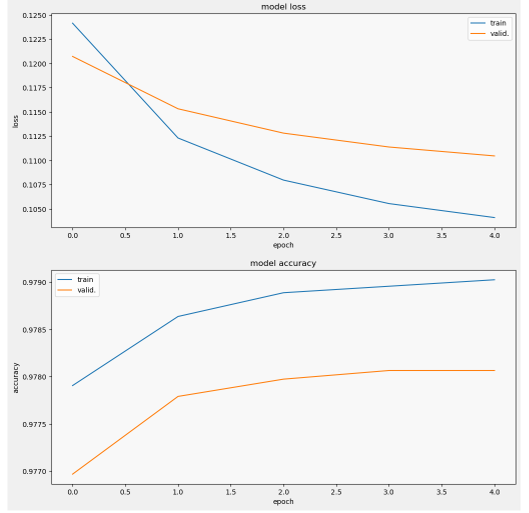

# Predicting Breast Cancer Using Computer Vision
#### An attempt to use machine learning to assist in diagnosing breast cancer from mammorgram scans

If you ask a bright-eyed classroom full of grade school kids "what do you want to do when you grow up?" you are bound to get at least a few "cure cancer!" responses. Finding the cure to cancer has long been a cultural goal, and for good reason: we all know someone whose life has been impacted by cancer. While the rate of diagnoses has decreased, the number of new cases and death is **increasing** as the population grows and ages. In the United States, the number of new female breast cancer cases has grown from 198,591 in 1999 to 264,121 in 2019 ([CDC Cancer Trends](https://gis.cdc.gov/Cancer/USCS/#/Trends/)). 

But when we get down to it, finding the almighty *Cure To Cancer* is not one single solution, but rather a series of technological advances applied with the ingenuity of many passionate individuals all working together. This project is focused on the point where the patient's life irreversibly shifts, where they hear the dreaded "C-word": the diagnosis. 

## Business Understanding

Apart from the obvious life-saving medical reasons to improve accuracy and efficiency of cancer diagnoses, there is a concerete business case for this type of work. Several possible benefits of developing this technology include:
- Minimizing costs resulting from secondary tests used to confirm diagnosis
- Minimizing medical costs to patients for unnecessary secondary tests and/or treatments
- Allowing medical professionals more time to dedicate to other patients, increasing hospital efficiency and decreasing burnout
- Many available funding sources, including government funding and foundations focused on cancer research
- Significant demand from hospitals and clinics

This illustrative list is nonexhaustive and could become more expansive specific when applied to a specific organization, such as product developer or hospital. 

## Data Understanding

The data for this project was gathered from Kaggle and was provided by the Radiological Society of North America (RSNA). The RSNA is a non-profit organization that represents 31 radiologic subspecialties and 145 countires around the world. They provided 54,708 scans from 11,913 patients to Kaggle for a [coding competition](https://www.kaggle.com/competitions/rsna-breast-cancer-detection/overview). This project was created following the Kaggle competition guidelines and all of the code was run on Kaggle servers then copied over to this git repository as a central source of documentation. 

**The notebooks in this GitHub repository will NOT correctly outside of Kaggle. Each notebook contains a link to it's Kaggle counterpart.**

 
Above, you can see two example images from the [Kaggle dataset](https://www.kaggle.com/competitions/rsna-breast-cancer-detection/data). The left image is from an individual with a positive breast cancer diagnosis and the image on the right is of a negative diagnosis.

- The dataset contains 54,708 scans from 11,913 patients
- The data was provided in DICOM format (a medical imaging format) which I converted to PNG format
- Each image is a scan of an individual breast and there are generally several images from each patient of different breasts and different angles
- The images show different placement of the areas of interest, differing exposure and brightness, and large amounts of negative space
- 1,158 of the images are positive of cancer and 53,548 images are negative
- This extreme imbalance will undoubtedly affect the performance of the model

## Modeling and Evaluation

To create a model, I used a Keras and Tensorflow to create a Convolutional Neural Network (CNN). CNNs are composed of layers of neurons, the structure of which is inspired by the human brain. A neural networks are often used for computer vision and image classification because they can process large amounts of data, like the individual pixels of an image, and extract features from them, like lines and edges. Since CNNs can be computationally expensive to train, I added layers to an existing model through transfer learning. The model I used is VGG19, a popular model for image classification. 

For my first successful model, I used binary crossentropy as the loss function and accuracy as the metric. As you can see below, the model did learn and improve, but only marginally. The model was submitted to the Kaggle competition where it is run on secret test data. The model recieved a score of 0, but it is unclear if there was a problem with the submission or if the model is at fault.

In my second model, I attempted to use F1 score as a metric alongside accuracy, as F1 score is generally a better metric for imbalanced datasets and for models where you want to minimize both False Negative and False Positive predictions. This model is incomplete, but could be a great jumping-off point for a continuation of this project

[source](https://towardsdatascience.com/evaluating-clustering-results-f13552ee7603)

## Conclusion

The models I build here are just the tip of the iceberg; with more time, resources, and knowledge this type of model could become a valuable tool in the breast cancer diagnosis process. Many more techniques could be utilized, such as data augmentation, cropping, Region of Interest (ROI) cropping, experiementing with different base models and layers, converting the DICOM images with different methods, and many many more. I am confident that computer vision will someday be used to assist medical professionals diagnosing cancer faster, earlier, and more accurately.

### With each experiment and iteration, we are one (tiny) step closer to fulfilling the universal dream of finding the *Cure to Cancer*

## Repository Navigation

**The notebooks in this GitHub repository will NOT correctly outside of Kaggle. Each notebook contains a link to it's Kaggle counterpart.**
To reproduce my results, go to the Kaggle link and click the "Copy & Edit" button in the top right-hand corner of the page to make your own copy of the notebook with all the relevent input files. You will also need to use the correct "Accelerator", or experiment with a different one! For training, I used GPU P100 and for inference I did not use an accelerator. Version updates can by viewed on Kaggle and not on this GitHub repository.

[My Kaggle page](https://www.kaggle.com/deannahedges) contains several additional scripts that I created through this process, but I have only uploaded into this repository the scripts that contrubuted to my final results.

| File or Folder | Description |
| --- | ----------- |
| README.md | This file: an overview and description of the project |
| Predicting Breast Cancer Using Computer Vision.pdf | A PDF version of my final project presentation |
| mammography-challenge-dicom-to-png.ipynb | Script used to convert DICOM images to 256x256 PNGs |
| mammography-training-model.ipynb | Script used to build first model |
| mammography-submission.ipynb | Script used for inference on test data and to submit to the Kaggle competition |
| Capstone Project Proposal.pdf | Original proposal of this project, includes description, forseen challenges, and reasoning for choosing this project |
| Images | A folder containing images used in the README |

